# The tiger.sh / leopard.sh build farm setup guide

How I set up a build machine.

# Tiger

## OS Installation

- Customize
  - Uncheck Printer Drivers
  - Uncheck Language Translations
  - Check X11
- Create the user `macuser`

See also https://www.peachpit.com/articles/article.aspx?p=454796&seqNum=3

## System Preferences

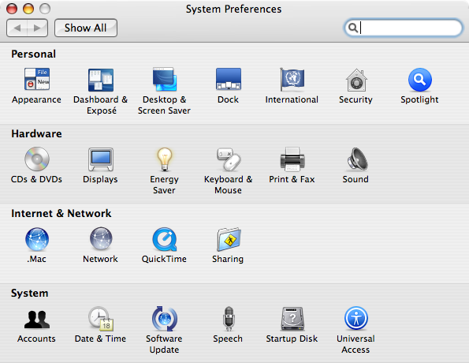

Desktop -> Screen Saver:
- Set to "never" (the screen saver burdens the CPU, blank the monitor instead)

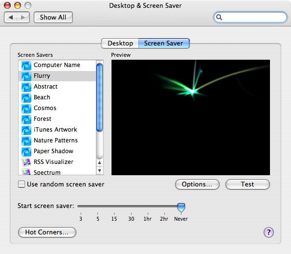

Energy Saver -> Optimization: Custom -> Sleep:
- Put the computer to sleep: never
- Uncheck "Put the hard disk to sleep"

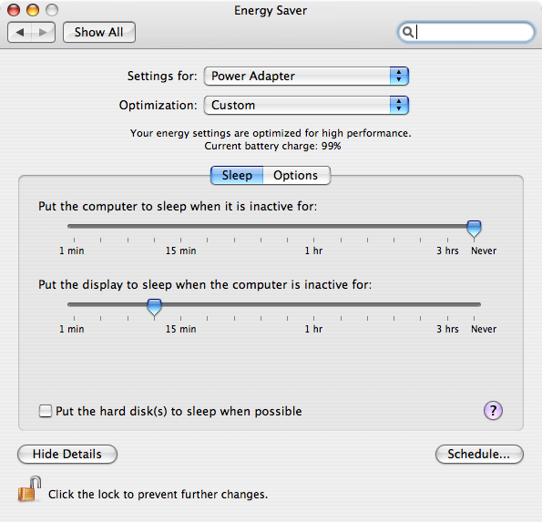

Energy Saver -> Optimization: Custom -> Options:
- Uncheck "Automatically reduce brightness" (these old LCD's are already too dim at full brightness)
- Processor Performance: Highest

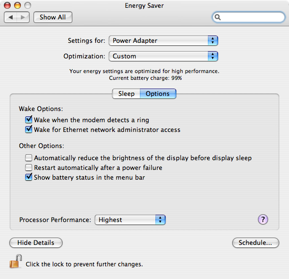

Keyboard & Mouse -> Trackpad:
- Trackpad Gestures:
  - Check Clicking, Dragging

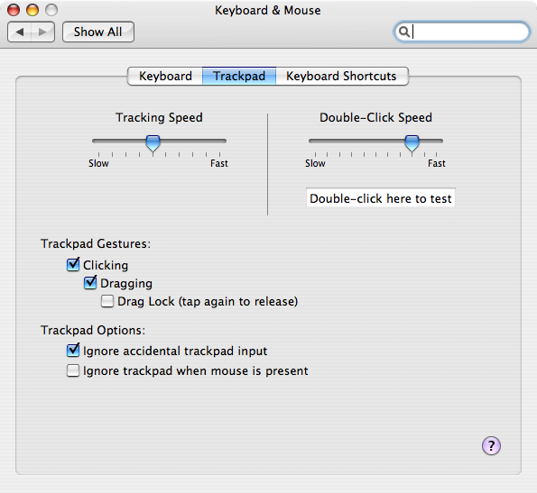

Network -> Built-in Ethernet
- Use DHCP if it works

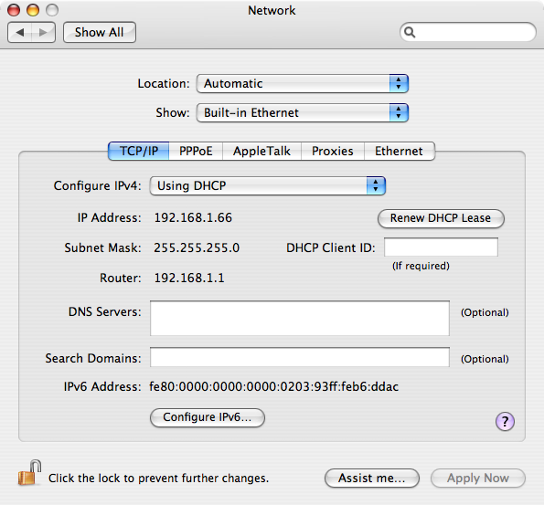

Network -> Built-in Ethernet
- Occasionally, Tiger will refuse a DHCP lease, which seems to happen after giving it a specific host name which is already a local DNS name?  This seems to go on for some amount of time, then fix itself automatically.  If you can't wait, just configure IPv4 manually:
  - Use the IP address to your hostname resolves via local DNS
  - Subnet Mask: `255.255.255.0`
  - Router: `192.168.1.1`
  - DNS Servers: `192.168.1.2`
  - Search Domains: `home`

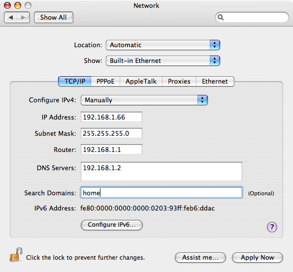

Sharing -> Services
- Check Remote Login
- Check Apple Remote Desktop

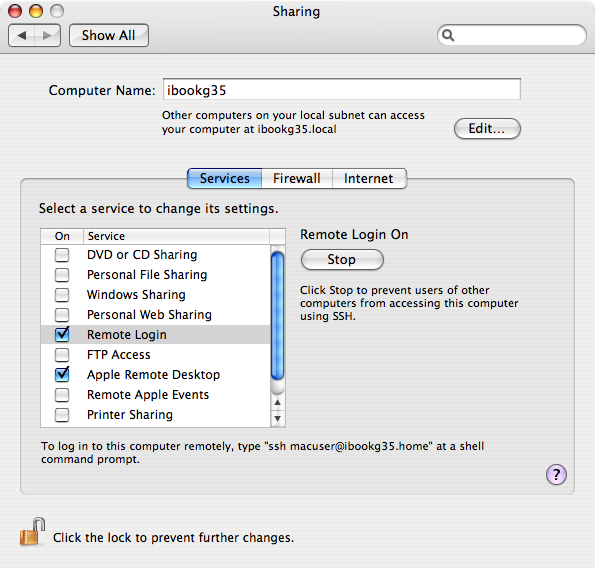

Sharing -> Services -> Apple Remote Desktop -> Access Privileges
- VNC viewers may access control screen with password: `<macuser's password>`

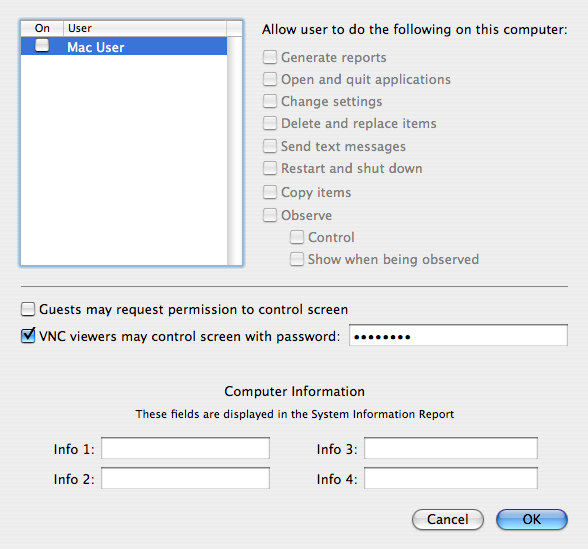

Date & Time
- Ensure "Set date & time automatically" is checked

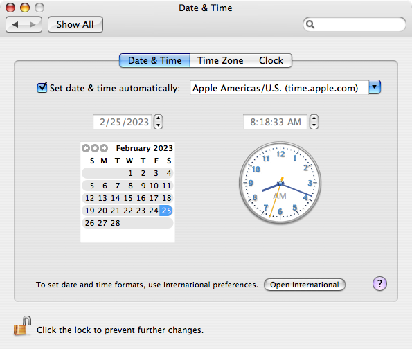

Date & Time -> Time Zone
- Ensure Austin is selected

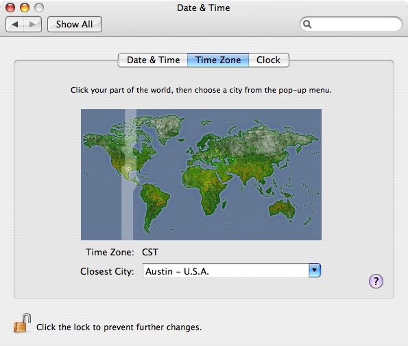

# Leopard

## System Preferences

TODO
