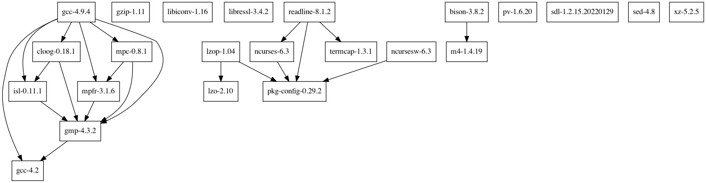

# `tiger.sh`

A package manager / builder for PowerPC Macs running OS X Tiger (10.5), written in Bash 😱

This is still a work-in-progress.

To install `tiger.sh`:

```
mkdir -p ~/bin
cd ~/bin
curl -O http://ssl.pepas.com/tigersh/tiger.sh
chmod +x tiger.sh
./tiger.sh --setup
```

To see the list of available packages:

```
$ tiger.sh 
Available packages:
autoconf-2.71
autogen-5.18.16
automake-1.16.5
bc-5.2.1
bison-3.8.2
cloog-0.18.1
...
```



To install a package:

```
$ tiger.sh automake-1.16.5
```

To remove a package:

```
$ tiger.sh --unlink automake-1.16.5
$ rm -r /opt/automake-1.16.5
```

Misc. other usage:

```
$ tiger.sh --os.cpu
tiger.g4e
```
